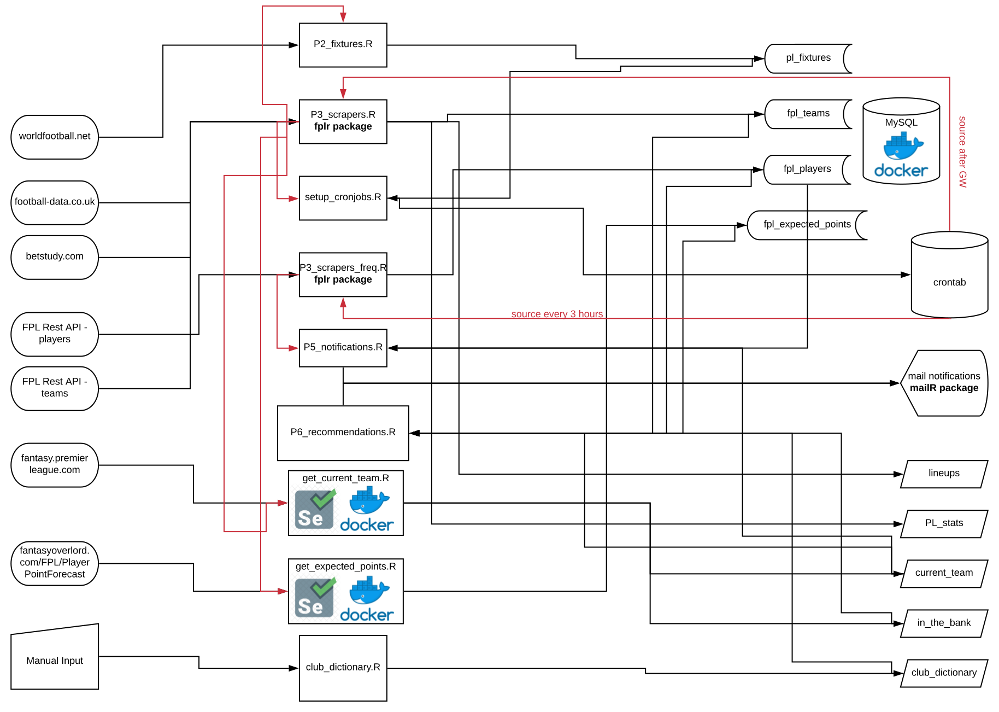

# FPL

In order to run simulation before start of new FPL season execute the following scripts in given order.

1. **club_dictionary.R** 
    - add new clubs
    - remove relegated clubs

2. **players_database_by_clubs.R**
    - change `se` parameter in http query (responsible for id of season. You can find it [here](https://www.premierleague.com/players))

3. **players_database.R**

4. **scrape_data.R**

5. **fpl_api.R**

6. **simulation.R**
